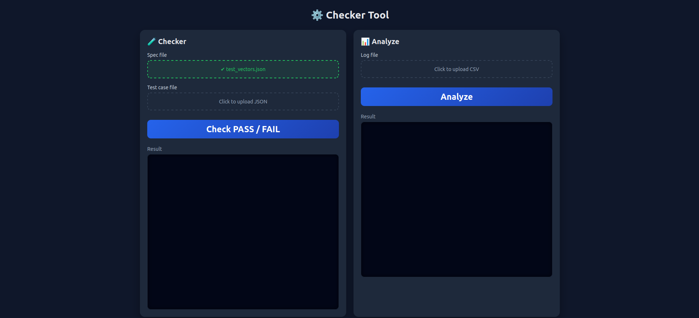

# Log Analytics & Automation Testing Tool

A web-based utility designed to automate the verification of test cases against technical specifications and analyze system logs.

## Key Features
- **Automated Verification:** Cross-checks test cases with specification documents to identify discrepancies.
- **Intelligent Log Parsing:** Uses Regex-based engines to extract critical errors and insights from raw system logs.
- **Insight Dashboard:** Displays a summary of flagged items requiring manual review via an intuitive web interface.
- **RESTful API:** Lightweight endpoints to integrate with other internal tools.

## Tech Stack
- **Backend:** Python (Flask)
- **Logic:** Regular Expressions (Regex), JSON Processing
- **Frontend:** HTML5, CSS3, JavaScript

1. Description  
    1. Test runner starts execution
    
    2. DUT behavior is simulated (Load test vectors from `test_vectors.json`.)
    
    3. Test cases validate measured values against specifications
    
    4. Final test result is recorded
    
    5. All results are saved into a CSV log file  

    6. Read log file, displays a summary of flagged items requiring manual review via an intuitive web interface.

2. Install Environment

- Language: Python

- Operating Mode: Offline simulation (no physical DUT)

- Input Files:

    - `test_vectors.json` – test cases and simulated measurements (stimulus)

    - `spec.json` – specification limits and expectations

- Output Files:

    - CSV log files stored in the `logs/` directory

3. Backend

- request example

```
curl -X POST http://127.0.0.1:5000/check \
  -F "spec=@spec.json" \
  -F "vectors=@test_vectors.json"

```

```sh

curl -X POST http://localhost:5000/api/analyze \
  -F "log=@logs.csv"
```

## Demo

<!-- [Video demo project](https://youtu.be/n8ApodyoMy0) -->

- Video

[](https://youtu.be/Uka86UzjxEk)

- Image


